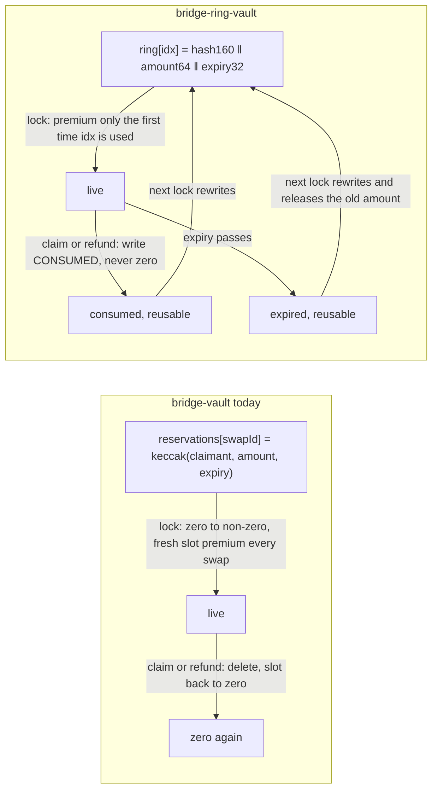
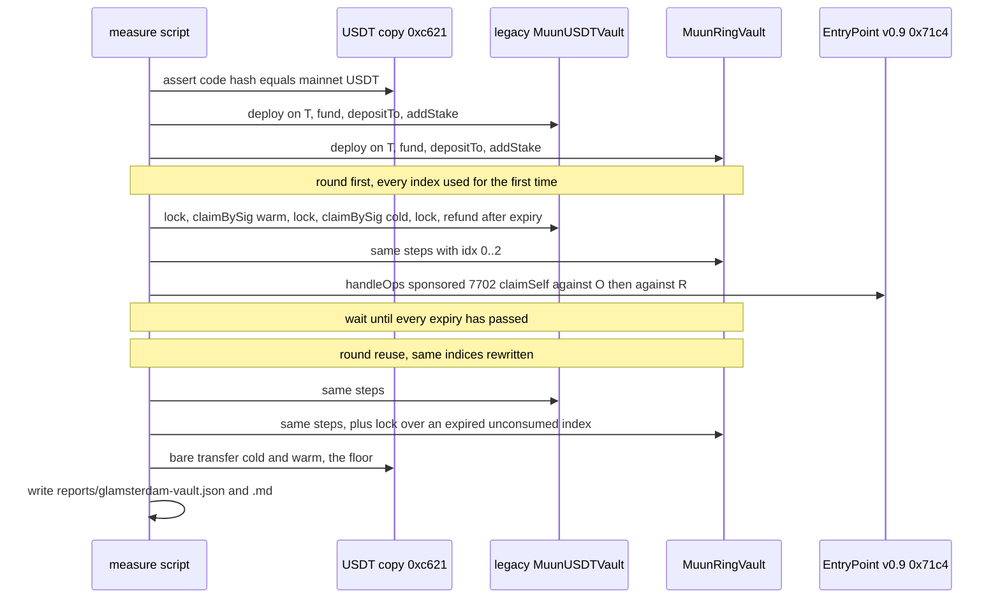

# bridge-ring-vault: plan

Status 2026-09-30: sections 1 to 4 done (contract, 74 tests, runner, receipts). The devnet run
of 2026-09-29 measured every step at least once and the locks of both rounds; its reuse-round
claims did not repeat because the public RPC went down (details in
`reports/glamsterdam-vault.md`, "What did not run"). Numbers in `docs/design.md` §4.

The Ethereum bridge vault of `bridge-vault` (`MuunUSDTVault`, lock / claimBySig / sponsored
claimSelf) rewritten so that reservations live in a ring of reusable storage slots, the way
`storage-proof-ring-swap` did for `Fulfillment.ring`. Goal: measure on the Glamsterdam devnet
(Platåberget) how much of the fresh-slot premium the ring removes from `lock`, with the old vault
re-measured in the same run as the baseline.

## TL;DR

- What changes: `mapping(bytes32 => bytes32) reservations` becomes `bytes32[2**32] ring`. A
  reservation is written into the index Muun picks. The slot is never zeroed again: `claim` and
  `refund` overwrite it with a non-zero `CONSUMED` marker, and `lock` may rewrite an index whose
  reservation expired or was consumed.
- What we expected [ESTIMATE, written before the run]: `lock` drops by about the fresh-slot
  premium measured on the ring repo (97,920 gas, 2026-09-28 receipts), from 157,208 to roughly
  59,000 in steady state; `claimBySig` rises by up to 4,800 gas for the lost clearing refund.
  Measured: `lock` 159,692 to 62,504 (−97,188); `claimBySig` +12,108, more than the refund
  alone.
- How we check it: one script, `npm run measure:glam`, deploys the old vault and the ring vault
  on the byte-exact mainnet USDT copy already on the devnet, runs the same steps against both
  (round `first`, wait for expiry, round `reuse`), and writes `reports/glamsterdam-vault.{json,md}`.

## 1. Storage: mapping entry vs ring entry

- What the table shows: the entry layout the ring vault stores per index and why each field is
  there.

| Bits | Field | Why |
|---|---|---|
| 255..96 | `hash160 = keccak(swapId, claimant, amount, expiry)[0:20]` | binds the slot to one swap and one claimant; 160 bits is the same preimage strength as an address |
| 95..32 | `amount` (uint64, USDT units) | lets `lock` release an expired reservation inline (`reserved -= amount`, `inFlight -= 1`) without a separate `refund` tx |
| 31..0 | `expiry` (uint32 timestamp) | the reuse rule: free when `expiry < block.timestamp` or when the entry is `CONSUMED` |

`CONSUMED = bytes32(uint256(1))`: non-zero, expiry bits 1, no real entry ever equals it. The
`_reserves` word (reserved + 1 ‖ inFlight) is unchanged; it was already kept non-zero.

Timestamps stay (the old vault, the claimant signatures and the paymaster expiry all use
`uint48` timestamps; 32 bits hold until 2106). There is no storage proof on this vault, so the
ring's slot position is not part of the protocol.

## 2. Contract changes

- What the table shows: every function of `MuunUSDTVault` and what the ring version does
  differently. New contract name `MuunRingVault`; the old one is kept verbatim under
  `contracts/legacy/` as the baseline of the run.

| Function | Old | Ring |
|---|---|---|
| `lock(swapId, claimant, amount, expiry)` | reverts if `reservations[swapId] != 0` | `lock(..., idx)`: reverts `SlotLive` if `ring[idx]` is live; if expired and not consumed, releases its amount and count first; writes the entry |
| `claimBySig(..., sig)` / `claimSelf(...)` | compare commitment, `delete` | `(..., idx)`: compare `ring[idx]` with the recomputed entry, write `CONSUMED`, transfer |
| `refund(...)` | permissionless after expiry, `delete` | `(..., idx)`: same rule, writes `CONSUMED` |
| `isReservation(...)` | mapping lookup | `(..., idx)`: entry comparison |
| `validatePaymasterUserOp` / `_screen` | parses 4 words of `claimSelf` (calldata 292 B) | parses 5 words (`idx` ≤ uint32.max, calldata 324 B, inner 164 B), checks `ring[idx]` |
| events `Locked`, `Redeemed`, `Refunded` | | gain `idx` so the claimant learns its index at lock time |
| everything else (deposit, withdraw, ETH, stake, gas caps) | | unchanged |

Rules to test (`test/unit/Ring.t.sol`, names R1..R6, plus the four old test files adapted):

1. R1 `lock` on a live index reverts `SlotLive(idx, expiry)`.
2. R2 `lock` on an expired, unconsumed index releases the old amount and count, then reserves the new one.
3. R3 no path ever writes zero into `ring` (claim, refund, lock over expired).
4. R4 a consumed entry cannot be claimed or refunded again (`InvalidReservation`).
5. R5 the same swap at a wrong `idx` is `InvalidReservation`, not a payout.
6. R6 `_screen` rejects an `idx` word above uint32.max and a reservation that is not at `idx`.

## 3. E2E on Glamsterdam (Platåberget, chainId 7091047534)

- What the table shows: the receipts the run produces per vault and round. Every number in the
  report is a receipt's `gasUsed`; expectations are labelled `[ESTIMATE]` until then.

| Step | Old vault | Ring vault | What it isolates |
|---|---|---|---|
| `lock` | fresh `reservations[swapId]` every time | index fresh in round `first`, rewritten in `reuse` | the fresh-slot premium |
| `claimBySig`, warm recipient | delete + refund | `CONSUMED` write | the lost clearing refund |
| `claimBySig`, cold recipient | | | the recipient premium, same on both |
| `refund` after expiry | delete | `CONSUMED` write | permissionless release |
| `lock` over an expired unconsumed index | n/a | inline release | the refund tx saved |
| sponsored `claimSelf` (7702 + 4337, self-bundled `handleOps`) | 577,886 outer on 2026-08-31 | | the escape hatch |
| bare `transfer` cold / warm | 152,417 / 54,497 on 2026-09-28 | | the floor |

Run parameters: `RESERVATION_TTL_SECONDS` short (60 s) so round `reuse` starts within minutes;
amount 10 USDT; both vaults get liquidity from the actor, which owns the USDT copy and can
`issue`; both get the same EntryPoint deposit and stake.

Accounts (env names only, never values): `GLAMSTERDAM_RPC_URL`, `GLAMSTERDAM_PRIVATE_KEY`
(the ring repo's devnet actor `0xAE3d…`, owner of the USDT copy, 2.44 ETH on 2026-09-29),
`BUNDLER_PRIVATE_KEY` (bridge-vault's bundler `0xbc27…`, needs ETH for `handleOps`),
`ENTRY_POINT_ADDRESS` `0x71c413…`, `SIMPLE_7702_ACCOUNT_ADDRESS` `0xdA213B…`,
`GLAMSTERDAM_USDT_COPY_ADDRESS` `0xc621…`, optional `LEGACY_VAULT_ADDRESS` and
`RING_VAULT_ADDRESS` to reuse deployments, `RESERVATION_TTL_SECONDS`, `AMOUNT_USDT`.

## 4. Repo layout and order of work

- What the table shows: what gets created, from where, in the order it will be done.

| # | Item | Source |
|---|---|---|
| 1 | `foundry.toml`, `remappings.txt`, `package.json`, `.gitignore`, `.env.example` (names only), `.env` mode 600 | bridge-vault, plus the ring repo's `GLAMSTERDAM_*` names |
| 2 | `contracts/legacy/MuunUSDTVault.sol`, `contracts/MockUSDT.sol` | bridge-vault, verbatim |
| 3 | `contracts/MuunRingVault.sol` | new, section 2 |
| 4 | `test/` (four files adapted) + `test/unit/Ring.t.sol` | bridge-vault tests + R1..R6 |
| 5 | `scripts/lib/common.mjs` (retrying sends, 503 handling), `scripts/measure-glamsterdam-vault.mjs`, `scripts/lib/userop.mjs` (the 7702 + 4337 op builder) | ring repo's measure script, bridge-vault's `recovery-path.mjs` |
| 6 | `npm run measure:glam`, `reports/glamsterdam-vault.{json,md}` | the run |
| 7 | `README.md`, `docs/design.md`, `docs/decisions.md` | after the receipts |

Repo rules carried over: measured numbers only, `[ESTIMATE]` otherwise; a "What the table
shows" bullet before every table; every external claim dated and sourced; no em-dashes; Herman
commits.

## 5. Open points to settle before coding

1. `amount` in the entry (inline release on reuse) versus a 224-bit hash like `Fulfillment` and a
   mandatory `refund` before reuse. Recommendation: amount in the entry; it removes a transaction
   and 160 bits of hash is enough.
2. Same-run baseline: redeploy the legacy vault on the USDT copy rather than reuse the 2026-08-31
   deployment on `MockUSDT`, so both columns share token, day and client. Recommendation: redeploy.
3. Keep timestamps for `expiry` (old vault semantics) rather than L1 block numbers (ring repo
   semantics). Recommendation: timestamps; this vault has no L1 clock to share with an L2.
