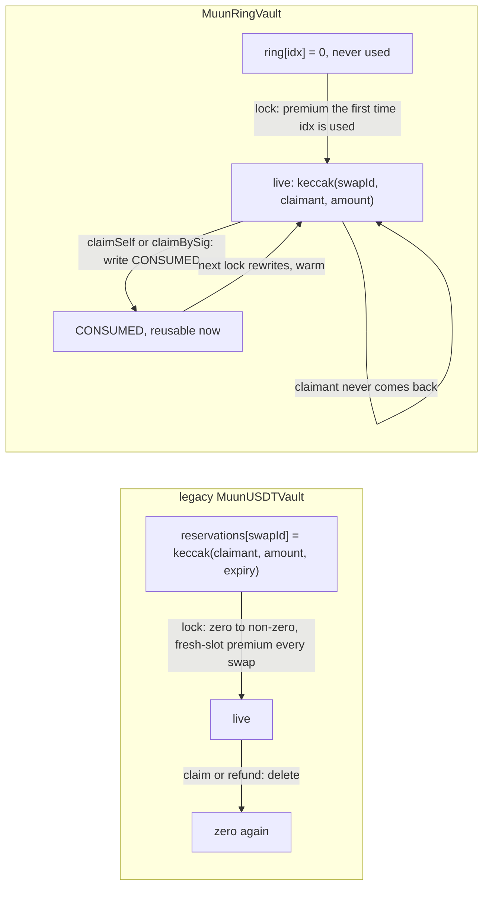
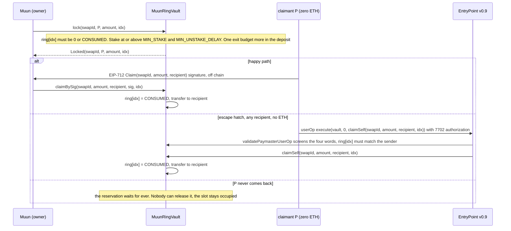

# Design: the reservation ring

## TL;DR

- `MuunRingVault` is bridge-vault's `MuunUSDTVault` with one change of state layout: the
  per-swap `reservations[swapId]` slot becomes an index in `bytes32[2**32] ring`, chosen by Muun
  at `lock`, reused forever.
- A reservation never expires (decision #7, 2026-10-01). Only `claimSelf` or `claimBySig` end
  it, by overwriting the slot with `CONSUMED`; the next `lock` rewrites it. There is no `refund`
  and no owner function that touches a live reservation: an abandoned reservation stays for
  ever, as if the USDT had been sent to `P`.
- The entry is the full 256-bit `keccak(swapId, claimant, amount)` (decision #8): nothing in
  the clear, birthday 2^128.
- `lock` requires the EntryPoint stake to satisfy the bundlers, `MIN_STAKE` and
  `MIN_UNSTAKE_DELAY` (decision #9, rule R7), not only the `staked` flag.
- Everything else (the EntryPoint deposit as the funding guarantee, the paymaster that sponsors
  the zero-ETH `claimSelf` to any recipient, the gas caps, `withdraw` gating) is unchanged; the
  paymaster reads a fourth argument, `idx`, and no longer a time bound.
- Numbers: `reports/local-vault-2026-10.md` (receipts, both vaults, same run, local
  Glamsterdam node, 2026-10-02). The earlier layout with `expiry` is in
  `reports/local-vault.md` (2026-09-30) and `reports/glamsterdam-vault.md` (Platåberget,
  2026-09-29).

## 1. Storage

- What the table shows: the entry per index and the reason for its shape.

| Value of `ring[idx]` | Meaning | Why |
|---|---|---|
| `0` | never used | the first `lock` here pays the fresh-slot premium once |
| `keccak256(abi.encode(swapId, claimant, amount))` | live reservation | binds the index to one swap, one claimant and one amount with all 256 bits; `lock` refuses to rewrite it, however old (R1, R2) |
| `CONSUMED = bytes32(uint256(1))` | consumed | non-zero so the slot is never re-created (R3); no reservation hashes to it (R4) |

`_reserves` (reserved + 1 ‖ inFlight) is the legacy word, unchanged. `amount` is bounded by the
128-bit `reserved` counter only.

## 2. Lifecycle

## 3. What changed in the contract

- What the table shows: every function of the legacy vault and what the ring version does
  differently. Rules R1..R7 are the contract header; R1..R6 are tested in
  `test/unit/Ring.t.sol`, R7 in `test/unit/SponsorshipFunding.t.sol`.

| Function | Legacy | Ring |
|---|---|---|
| `lock(swapId, claimant, amount, expiry)` | reverts if `reservations[swapId] != 0`; checks `staked` | `lock(swapId, claimant, amount, idx)`: no expiry; `SlotLive` unless `ring[idx]` is `0` or `CONSUMED` (R1, R2); `StakeTooLow` / `UnstakeDelayTooShort` below the floors (R7); writes the entry |
| `claimBySig(swapId, amount, recipient, expiry, sig)` / `claimSelf(..., expiry)` | compare commitment, check `expiry`, `delete` | `(swapId, amount, recipient[, sig], idx)`: no time check; compare `ring[idx]` with the recomputed entry, write `CONSUMED` (R3, R4, R5) |
| `refund` | permissionless after expiry, `delete` | removed: nothing expires |
| `isReservation(..., expiry)` | mapping lookup | `isReservation(swapId, claimant, amount, idx)`: entry comparison; `entry(swapId, claimant, amount)` is public |
| `_screen` (paymaster) | 4 words of `claimSelf` incl. `expiry`, calldata 292 B, returns `validUntil = expiry` | 4 words (`swapId, amount, recipient, idx`), calldata 292 B with the 28 padding bytes required zero, `idx` ≤ uint32.max, `ring[idx]` must hold the sender's reservation (R6), no `validUntil` |
| events | `Locked(..., expiry)`, `Redeemed`, `Refunded` | `Locked(swapId, claimant, amount, idx)`, `Redeemed(..., idx)`; `Refunded` and `Released` gone |
| `Config` | ten fields | plus `minStake`, `minUnstakeDelaySec` (immutables `MIN_STAKE`, `MIN_UNSTAKE_DELAY`) |
| EIP-712 | `Claim(bytes32 swapId,uint256 amount,address recipient,uint48 expiry)`, version "1" | `Claim(bytes32 swapId,uint256 amount,address recipient)`, version "3" (decision #11) |
| deposit, withdraw, ETH, stake, caps, funding guarantee | | unchanged |

## 4. What the ring costs and saves

Receipts of 2026-10-02 on the local Glamsterdam node (geth 1.17.6, Amsterdam at genesis, the
`glamsterdam-local` repo), both vaults deployed by the same run on the byte-exact mainnet USDT
copy; full tables in `reports/local-vault-2026-10.md`.

- What the table shows: the receipt's `gasUsed` per step, legacy vault against ring vault, and
  the difference. Locks are round-reuse receipts (the steady state); claim-side rows measure the
  same write in either round. The last column is the same step on the previous ring layout
  (160-bit hash with `amount` and `expiry` inline), same node, 2026-09-30
  (`reports/local-vault.md`).

| Step | legacy | ring | Δ ring − legacy | ring, previous layout (2026-09-30) |
|---|---:|---:|---:|---:|
| `lock`, index used for the first time | 159,794 | 159,795 | +1 | 160,500 |
| `lock`, index reused | 159,782 | 61,889 | −97,893 | 62,594 |
| `claimBySig`, warm recipient | 81,817 | 93,524 | +11,707 | 93,949 |
| `claimBySig`, cold recipient | 179,761 | 191,456 | +11,695 | 191,881 |
| sponsored `claimSelf`, outer `handleOps` tx | 486,703 | 498,026 | +11,323 | 499,266 |
| sponsored `claimSelf`, `actualGasUsed` charged by the EntryPoint | 338,712 | 338,882 | +170 | (in the json) |
| `refund` | 35,037 | none | n/a | 44,292 |
| expired swap (`lock` + `refund`) | 194,819 | none: nothing expires | n/a | 54,297 (inline release on the next `lock`) |
| happy path per swap, warm (`lock` + `claimBySig`) | 241,599 | 155,413 | −86,186 | 156,543 |
| happy path per swap, cold | 339,543 | 253,345 | −86,198 | 254,475 |
| escape hatch per swap (`lock` + outer tx) | 646,485 | 559,915 | −86,570 | 561,860 |

What the numbers say:

- The fresh-slot premium as paid on this node is 97,906 gas (ring lock, first use against
  reuse). The legacy vault pays it on every swap; the ring pays it once per index.
- Dropping `expiry` made the ring cheaper than its previous layout on every step: `lock` −705,
  `claimBySig` −425, the sponsored exit −1,240 on the outer transaction. One calldata word, one
  range check, one time check and the entry packing are gone; the two stake comparisons of R7,
  the `amount` bound and the zero-padding check of the paymaster cost less than that.
- The claim side still costs about 11,700 gas more than the legacy vault: the `CONSUMED` write
  is a non-zero to non-zero store with no clearing refund, plus the `idx` word and event field.
- Net: 86,186 gas less per happy-path swap, 36% of the legacy figure.
- The escape hatch is unchanged in kind: the EntryPoint charges 170 gas more (the padding check
  in the paymaster screen).
- What the ring no longer has a number for: an expired swap. The legacy vault spends 194,819
  gas in two transactions to recycle an abandoned reservation; the ring leaves it in place and
  takes another index. The cost moved from gas to pinned liquidity (decision #7).

## 5. Operational notes

- Muun allocates indices. Any policy works (lowest consumed index first, a never-used index
  when concurrency grows); a live index simply reverts `SlotLive`, so an allocator bug costs a
  failed transaction, never funds. The used part of the ring is peak concurrency plus abandoned
  reservations; `2^32` indices is not a practical bound.
- The claimant must keep `idx` next to `swapId`; both are in `Locked`. A claim at the wrong
  index is `InvalidReservation` (R5). The client checks `ring[idx] == keccak(swapId, P, amount)`
  at the confirmed block before revealing anything.
- An abandoned reservation keeps `reserved` and `inFlight` (and so the deposit requirement)
  for ever. Muun's only way to recover it is a claim signed by `P`, which it can produce only
  if `u` leaks through the user's own refund path. Size the liquidity and the deposit with that
  in mind.
- Never lock the same `(swapId, claimant, amount)` twice: a `Claim` signature is bound to that
  triple, not to an index, and one signature would claim both (decision #11). A fresh `P` per
  swap and `swapId = keccak(T, U)` make this automatic.
- The stake floors are immutable. Set `minStake` and `minUnstakeDelaySec` to what the bundlers
  of the target chain enforce (decision #9), and stake at or above them before the first `lock`.
