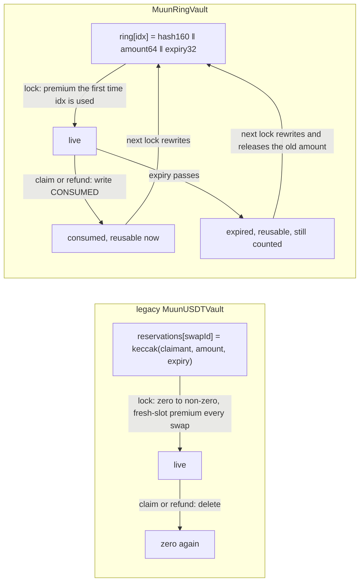
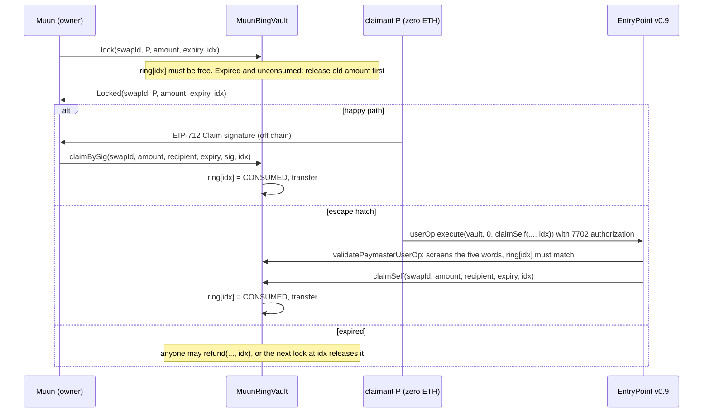

# Design: the reservation ring

## TL;DR

- `MuunRingVault` is bridge-vault's `MuunUSDTVault` with one change of state layout: the
  per-swap `reservations[swapId]` slot becomes an index in `bytes32[2**32] ring`, chosen by Muun
  at `lock`, reused forever.
- A slot is never zeroed: `claim` and `refund` overwrite it with `CONSUMED`, the next `lock`
  rewrites it. An expired, unconsumed slot is released by the `lock` that rewrites it.
- Everything else (the EntryPoint deposit as the funding guarantee, the paymaster that sponsors
  the zero-ETH `claimSelf`, the gas caps, `withdraw` gating) is unchanged; the paymaster only
  learned to read a fifth argument.
- Numbers: `reports/glamsterdam-vault.md` (receipts, both vaults, same run).

## 1. Storage

- What the table shows: the entry layout and the reason for each field.

| Bits | Field | Why |
|---|---|---|
| 255..96 | `keccak(swapId, claimant, amount, expiry)[0:20]` | binds the slot to one swap and one claimant; 160 bits is the preimage strength of an address |
| 95..32 | `amount` (uint64) | lets `lock` release an expired reservation inline, no `refund` transaction needed |
| 31..0 | `expiry` (uint32 timestamp) | the reuse rule: free when `expiry < block.timestamp`, or when the entry is `CONSUMED` |

`CONSUMED = bytes32(uint256(1))`: non-zero, expiry 1, no reservation hashes to it. `_reserves`
(reserved + 1 ‖ inFlight) is the legacy word, unchanged.

## 2. Lifecycle

## 3. What changed in the contract

- What the table shows: every function of the legacy vault and what the ring version does
  differently. Rules R1..R6 are the contract header and `test/unit/Ring.t.sol`.

| Function | Legacy | Ring |
|---|---|---|
| `lock(swapId, claimant, amount, expiry)` | reverts if `reservations[swapId] != 0` | `lock(..., idx)`: `SlotLive` if `ring[idx]` is live (R1); if expired and unconsumed, releases its amount and count first, emits `Released` (R2); writes the entry |
| `claimBySig` / `claimSelf` | compare commitment, `delete` | `(..., idx)`: compare `ring[idx]` with the recomputed entry, write `CONSUMED` (R3, R4, R5) |
| `refund` | permissionless after expiry, `delete` | `(..., idx)`: same rule, writes `CONSUMED` |
| `isReservation` | mapping lookup | `(..., idx)`: entry comparison; `entry(...)` is public |
| `_screen` (paymaster) | 4 words of `claimSelf`, calldata 292 B | 5 words, calldata 324 B, `idx` ≤ uint32.max, `ring[idx]` must hold the sender's reservation (R6) |
| events | | `Locked`, `Redeemed`, `Refunded` carry `idx`; new `Released(idx, amount)` |
| EIP-712 domain | version "1" | version "2" (decision #6) |
| deposit, withdraw, ETH, stake, caps, funding guarantee | | unchanged |

## 4. What the ring costs and saves

Receipts of 2026-09-29 on Platåberget, both vaults deployed by the same run on the byte-exact
mainnet USDT copy; full tables and links in `reports/glamsterdam-vault.md`.

- What the table shows: the receipt's `gasUsed` per step, legacy vault against ring vault, and
  the difference. Locks are round-reuse receipts (the steady state); the claim-side rows are
  round-first receipts, which measure the same write.

| Step | legacy | ring | Δ ring − legacy |
|---|---:|---:|---:|
| `lock`, index used for the first time | 159,692 | 160,410 | +718 |
| `lock`, index reused | 159,692 | 62,504 | −97,188 |
| `lock` over an expired, unconsumed reservation | 35,047 + 159,692 (`refund` + `lock`, two txs) | 54,183 (one tx) | −140,556 |
| `claimBySig`, warm recipient | 81,841 | 93,949 | +12,108 |
| `claimBySig`, cold recipient | 179,761 | 191,869 | +12,108 |
| sponsored `claimSelf`, outer `handleOps` tx | 491,763 | 504,314 | +12,551 |
| sponsored `claimSelf`, `actualGasUsed` charged by the EntryPoint | 342,684 | 343,429 | +745 |
| `refund` | 35,037 | 44,292 | +9,255 |
| happy path per swap, warm (`lock` + `claimBySig`) | 241,533 | 156,453 | −85,080 |
| happy path per swap, cold | 339,453 | 254,373 | −85,080 |
| escape hatch per swap (`lock` + outer tx) | 651,455 | 566,818 | −84,637 |

What the numbers say:

- The fresh-slot premium as paid on this devnet is 97,906 gas (ring lock, first use against
  reuse). The legacy vault pays it on every swap; the ring pays it once per index.
- The claim side costs 9,000 to 12,500 gas more on the ring: the `CONSUMED` write is a non-zero
  to non-zero store with no clearing refund, plus one calldata word and one event field. That
  is more than the 4,800 refund alone; the devnet's repriced state access makes up the rest.
- Net: 85,080 gas less per happy-path swap, 35% of the legacy figure, and one transaction less
  whenever an expired reservation is reused.
- The escape hatch is unchanged in what the EntryPoint charges (+745 gas).

## 5. Operational notes

- Muun allocates indices. Any policy works (round robin over a window, lowest free); a live index
  simply reverts `SlotLive`, so an allocator bug costs a failed transaction, never funds.
- The claimant must keep `idx` next to `swapId`; both are in `Locked`. A claim at the wrong index
  is `InvalidReservation` (R5).
- `refund` still exists for liquidity: an expired reservation keeps `reserved` and `inFlight`
  (and therefore the deposit requirement) until it is refunded or its slot is rewritten.
